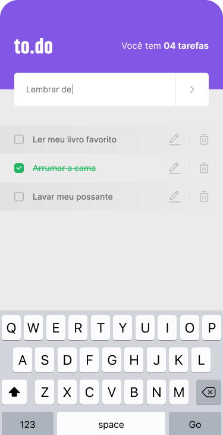
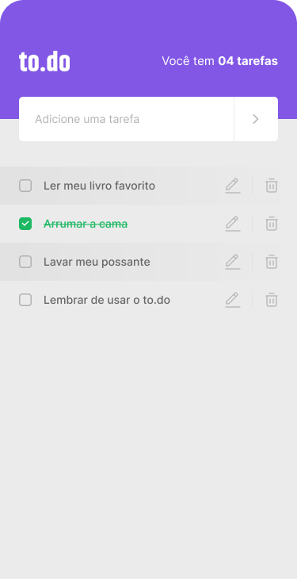

<h1 align="center">TODO</h1>

## Introdução

O TODO é um aplicativo para controle de tarefas, onde o usuário pode inserir uma tarefa, marcar como concluída ou excluí-la da listagem.

É um projeto que possuí o intuíto de aplicar os conceitos básicos aprendidos no módulo 1 do curso Ignite React Native da Rocketseat versão 2021.

<div align="center">
  
  
  
</div>

## Tecnologias 

- React Native
- Typescript
- Jest

## Requisitos

- Nodejs
- React Native cli
- Emulador Android Studio


## Instalação

```sh
# Fazer o clone do projeto em uma máquina local
git clone https://github.com/marciovz/todo-mobile-ignite2021.git
```

```sh
# Acessa a pasta do projeto
cd todo-mobile-ignite2021
```

```sh
# Rodar a instalação das dependências do projeto
npm install
```

## Rodando a aplicação

Abrir o emulador ou conectar um dispositivo para rodar a aplicação

```sh
# Rodar o bundle da aplicação.
npx react-native start
```

```sh
# Rodar a aplicação
npx react-native run-android
```
